# Coral Rust 项目设计说明

本文整理当前 `coral-rust` 分支的设计思路、模块职责、调用链路和部署形态。当前项目已经从旧 Java / Gradle 后台收敛为 **Rust 后端 + Rust CLI + Next.js 前端**。

## 1. 项目定位

Coral Rust 的核心目标是：

- 用 Rust 替代旧 Java / Calcite 后台中常用的 SQL 翻译能力。
- 提供无需 JVM、无需 Gradle、无需启动 server 的本地 CLI。
- 提供 HTTP service，兼容前端和原 Java `coral-service` 的主要接口路径。
- 提供 Web UI，用于 SQL 翻译、校验、可视化、函数映射查询和本地历史管理。
- 提供 FFI / Python 包装能力，便于非 Rust 语言集成。

当前主线不再依赖旧 Java 模块，核心目录是：

```text
coral-rust/              Rust workspace
coral-service/frontend/  Next.js 前端
```

## 2. 总体设计原则

### 2.1 Rust-first

旧 Java 版本依赖 Apache Calcite、JVM、Gradle 和多个 Java module。当前 Rust 版本把最常用的 SQL 翻译链路收敛为：

```text
SQL 文本 -> sqlparser-rs AST -> AST rewrite -> 目标 SQL 文本
```

这样带来的收益：

- CLI 可以编译为单个原生二进制。
- 冷启动快，适合 shell、调度任务、数据迁移脚本调用。
- 不要求部署 JVM / Gradle / Java service。
- 核心能力可以被 CLI、HTTP service、FFI、Python wrapper 复用。

### 2.2 核心能力下沉到 `coral-core`

所有入口都尽量复用 `coral-core`：

- CLI：`coral-rust/cli`
- HTTP service：`coral-rust/service`
- Trino facade：`coral-rust/trino`
- FFI：`coral-rust/ffi`
- Schema / Spark / E2E 等辅助 crate

核心翻译规则只维护一份，避免 CLI 和 service 行为漂移。

### 2.3 文本翻译优先，元数据能力可选

`coral-core` 默认是纯文本翻译：

- 不执行 SQL
- 不连接数据库
- 不强制依赖 Hive Metastore
- 不需要真实 schema

如果需要 schema-aware 校验，可以接入：

- `InMemoryCatalog`
- `coral-hive-catalog`
- 自定义实现 `Catalog` trait 的元数据源

### 2.4 接口适配层分离

不同调用方式只作为适配层：

- `cli` 处理命令行参数、stdin/file、退出码、UDF 白名单。
- `service` 处理 HTTP JSON / text/plain 协议。
- `frontend` 处理交互体验。
- `ffi` 处理 C ABI 内存模型。

核心 SQL 逻辑不散落在这些入口层里。

## 3. 总体架构

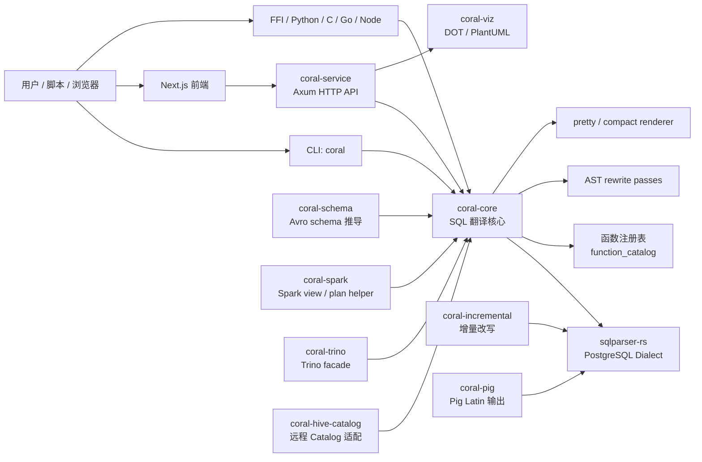

## 4. 仓库结构

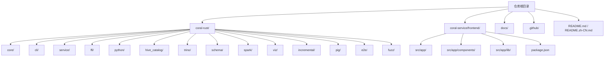

## 5. Rust workspace 模块职责

`coral-rust/Cargo.toml` 当前 workspace members：

```text
core, cli, ffi, hive_catalog, trino, service, schema, spark, viz, incremental, pig, e2e
```

| 模块 | crate / binary | 主要职责 | 依赖关系 |
|---|---|---|---|
| `core/` | `coral-core` | SQL 翻译核心；预处理、解析、函数映射、类型映射、结构改写、渲染 | 依赖 `sqlparser` / `thiserror` |
| `cli/` | binary `coral` | 本地命令行转换；支持 stdin/file、`--source`、`--target`、UDF 白名单、退出码判断 | 依赖 `coral-core` |
| `service/` | binary `coral-service` | Axum HTTP 服务；提供前端 API；兼容 Java service 路径 | 依赖 `coral-core` / `coral-trino` / `coral-viz` |
| `ffi/` | `coral-ffi` | C ABI；输出 `.so` / `.dylib` / `.dll` / `.a`；供 Python、Go、Node、C 调用 | 依赖 `coral-core` |
| `python/` | `coral-sql` | Python `ctypes` wrapper 和 wheel 打包目录 | 加载 `coral-ffi` 动态库 |
| `hive_catalog/` | `coral-hive-catalog` | 远程 Hive Metastore / Iceberg REST / Unity Catalog 风格元数据适配 | 实现 `coral_core::Catalog` |
| `trino/` | `coral-trino` | Trino 输出 facade；提供 `to_trino_sql` 等便捷 API | 依赖 `coral-core` |
| `schema/` | `coral-schema` | 从 SQL view 推导 Avro schema | 依赖 `coral-core` / `sqlparser` |
| `spark/` | `coral-spark` | Spark view 准备、Spark plan pushed filter 分析 | 依赖 `coral-core` / `coral-schema` |
| `viz/` | `coral-viz` | SQL AST 可视化；输出 Graphviz DOT / PlantUML 源码 | 依赖 `sqlparser` |
| `incremental/` | `coral-incremental` | 增量物化视图 SQL 改写；生成 delta 表组合的 `UNION ALL` | 依赖 `sqlparser` |
| `pig/` | `coral-pig` | SQL 到 Pig Latin 的 best-effort 输出 | 依赖 `sqlparser` |
| `e2e/` | `coral-e2e` | 跨 crate 集成测试，验证 core/service/schema/spark/viz/pig/incremental 组合行为 | dev-dependencies 聚合 |
| `fuzz/` | 独立 fuzz manifest | `cargo-fuzz` 入口，故意不加入主 workspace | 依赖 nightly / libFuzzer |

## 6. Rust crate 依赖关系

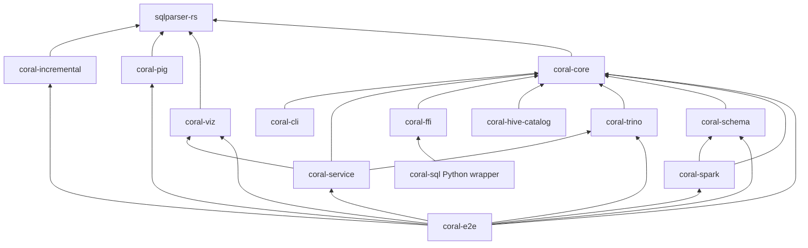

## 7. `coral-core` 翻译管线

`coral-core` 是整个项目最核心的模块。它负责把源 SQL 转换为 Spark / Trino 目标 SQL。

```mermaid
flowchart TD
  Input[输入 SQL 文本] --> Preprocess[文本预处理 preprocess]

  Preprocess --> ConnectBy[CONNECT BY / START WITH\n改写为 WITH RECURSIVE]
  Preprocess --> OracleJoin[Oracle (+) 外连接\n改写为 LEFT JOIN]

  ConnectBy --> Parse[sqlparser-rs 解析\nPostgreSQLDialect]
  OracleJoin --> Parse

  Parse --> AST[SQL AST]
  AST --> UnknownFn[可选：未知函数检测\nunknown_functions]
  AST --> Rewrite[AST rewrite passes]

  Rewrite --> Structure[DISTINCT ON\n-> ROW_NUMBER 子查询]
  Rewrite --> Functions[函数/运算符 rewrite\nNVL / DECODE / SUBSTR / MOD / regex]
  Rewrite --> Types[类型 rewrite\nJSONB / UUID / BYTEA / TIMESTAMPTZ]
  Rewrite --> Target{目标方言}

  Target -->|Spark| SparkSQL[Spark SQL AST]
  Target -->|Trino| TrinoDiff[叠加 Trino 函数/类型差异 rewrite]
  TrinoDiff --> TrinoSQL[Trino SQL AST]

  SparkSQL --> Render[Display / pretty_print]
  TrinoSQL --> Render
  Render --> Output[输出 SQL 文本]
```

### 7.1 预处理层

位于：

```text
coral-rust/core/src/preprocess/
```

作用：处理 `sqlparser-rs` PostgreSQL dialect 不直接支持、但 GaussDB / Oracle 风格里常见的语法：

- `START WITH ... CONNECT BY`
- Oracle `(+)` 外连接

### 7.2 AST rewrite 层

位于：

```text
coral-rust/core/src/rewrite/
```

主要 pass：

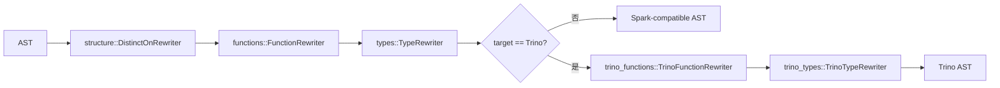

### 7.3 函数注册表

位于：

```text
coral-rust/core/src/function_catalog.rs
```

职责：记录已知函数及处理策略：

| 策略 | 含义 |
|---|---|
| `Passthrough` | 目标引擎原生支持，原样输出 |
| `Rename` | 只改函数名，参数顺序不变 |
| `CustomRewrite` | 改写函数结构，比如 `DECODE` -> `CASE WHEN` |
| `UnsupportedBySpark` | 已知但 Spark 没有等价实现，按策略透传或提醒 |

CLI 默认会调用 `unknown_functions` 检测未注册函数。如果发现未知函数：

- 默认报错，退出码非 `0`
- 使用 `--allow-unknown-functions UDF1,UDF2` 可白名单透传
- 使用 `--allow-unknown-functions` 可放行全部未知函数

## 8. CLI 设计

CLI 位于：

```text
coral-rust/cli/
```

binary 名称：

```text
coral
```

### 8.1 CLI 输入输出约定

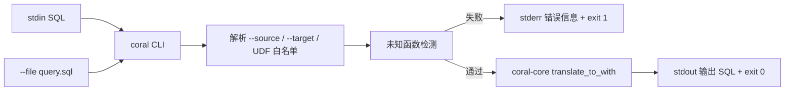

### 8.2 shell 集成约定

CLI 使用 Unix 标准退出码：

| 场景 | 退出码 | 输出 |
|---|---:|---|
| 成功 | `0` | 翻译后的 SQL 写入 `stdout` |
| 参数错误 | 非 `0` | 错误写入 `stderr` |
| SQL 解析失败 | 非 `0` | 错误写入 `stderr` |
| 未知函数未允许 | 非 `0` | 错误写入 `stderr` |

因此部署脚本可以直接用：

```bash
if ./coral --file input.sql --from gaussdb --to spark > output.sql 2> error.log; then
  echo "success"
else
  cat error.log >&2
  exit 1
fi
```

### 8.3 可移植性

CLI 二进制不是“一次编译，到处运行”。而是：

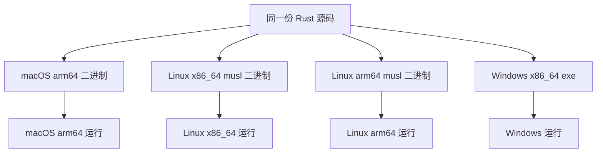

已编译的对应平台二进制运行时不需要：

- Rust
- Cargo
- Java
- Gradle
- Node.js
- HTTP server
- 数据库

Linux 推荐使用 `musl` 静态构建，减少目标机器系统库依赖。

## 9. HTTP service 设计

HTTP service 位于：

```text
coral-rust/service/
```

技术栈：

- `axum`
- `tokio`
- `tower-http` CORS / tracing
- `serde` / `serde_json`

默认监听：

```text
0.0.0.0:8080
```

可通过环境变量覆盖：

```bash
CORAL_BIND=127.0.0.1:9000 cargo run -p coral-service
```

### 9.1 HTTP API

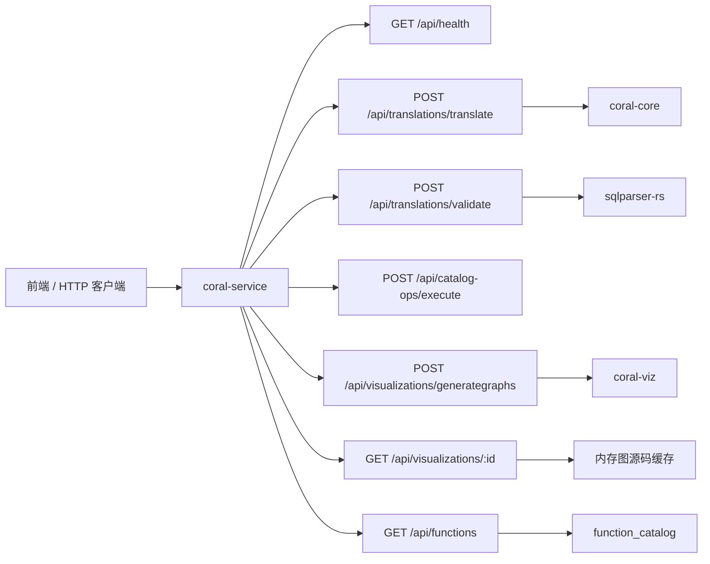

| 方法 | 路径 | 作用 |
|---|---|---|
| `GET` | `/api/health` | 健康检查 |
| `POST` | `/api/translations/translate` | SQL 方言翻译 |
| `POST` | `/api/translations/validate` | SQL parse-only 校验 |
| `POST` | `/api/catalog-ops/execute` | 兼容前端 Settings Catalog 的 CREATE 接口 |
| `POST` | `/api/visualizations/generategraphs` | 生成 DOT / PlantUML 图源码并返回 ID |
| `GET` | `/api/visualizations/{id}` | 根据 ID 获取图源码 |
| `GET` | `/api/functions` | 返回函数注册表 JSON |

### 9.2 翻译请求时序

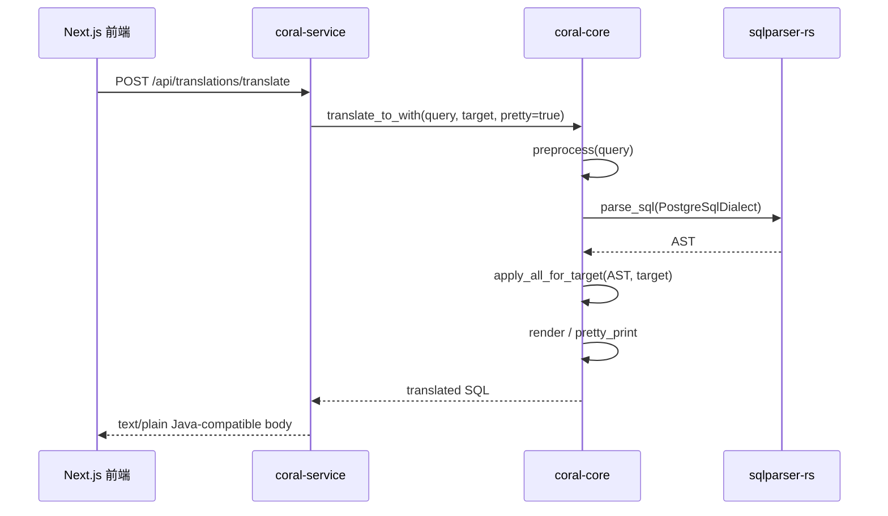

### 9.3 可视化请求时序

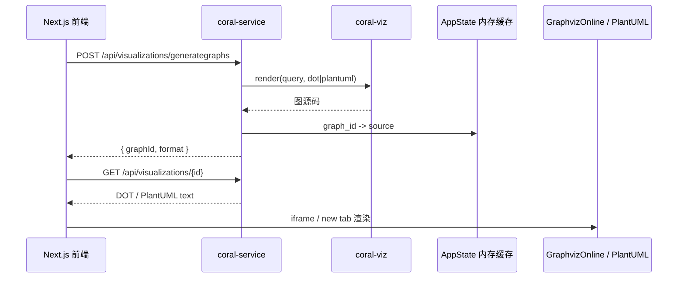

## 10. 前端设计

前端位于：

```text
coral-service/frontend/
```

技术栈：

- Next.js `13.4`
- React `18`
- Tailwind CSS
- CodeMirror SQL editor
- `sql-formatter`
- `cmdk` 命令面板
- `lucide-react` 图标

### 10.1 页面结构

```mermaid
flowchart TB
  App[Next.js App Router] --> Layout[app/layout.js]
  Layout --> I18n[I18nProvider]
  Layout --> Shell[Shell 布局]

  Shell --> Sidebar[左侧导航]
  Shell --> Topbar[顶部命令栏]
  Shell --> RecentDrawer[右侧 Recent 抽屉]
  Shell --> CommandPalette[命令面板]

  Shell --> Translate[/ 翻译页]
  Shell --> Validate[/validate 校验页]
  Shell --> Visualize[/visualize 可视化页]
  Shell --> Functions[/functions 函数表]
  Shell --> History[/history 历史页]
  Shell --> Settings[/settings 设置页]
```

### 10.2 前端模块职责

| 路径 | 职责 |
|---|---|
| `src/app/layout.js` | 根布局，加载字体、i18n、Shell |
| `src/app/components/Shell.js` | 全局框架：左侧导航、顶部命令栏、主题、语言、Recent 抽屉入口 |
| `src/app/components/SqlEditor.js` | CodeMirror SQL 编辑器；语法高亮、快捷键提交/格式化、明暗主题 |
| `src/app/components/HistoryDrawer.js` | 右侧 Recent 抽屉；展示、搜索、收藏、删除历史记录 |
| `src/app/components/CommandPalette.js` | `⌘K` 命令面板；导航、打开 Recent、切换主题/语言、清空历史 |
| `src/app/components/ui.js` | Card、Button、Pill、CodeBlock 等 UI primitives |
| `src/app/lib/client.js` | 浏览器端工具：API_BASE、localStorage history、SQL 格式化、响应解析 |
| `src/app/lib/i18n.js` | 中英文文案和语言状态 |
| `src/app/page.js` | SQL 翻译主页面 |
| `src/app/validate/page.js` | SQL parse 校验页面 |
| `src/app/visualize/page.js` | SQL AST 可视化页面，集成 GraphvizOnline / PlantUML |
| `src/app/functions/page.js` | 函数注册表查询页面 |
| `src/app/history/page.js` | 历史记录完整页面 |
| `src/app/settings/page.js` | 设置、语言/主题、Catalog 兼容入口、About |

### 10.3 前端数据流

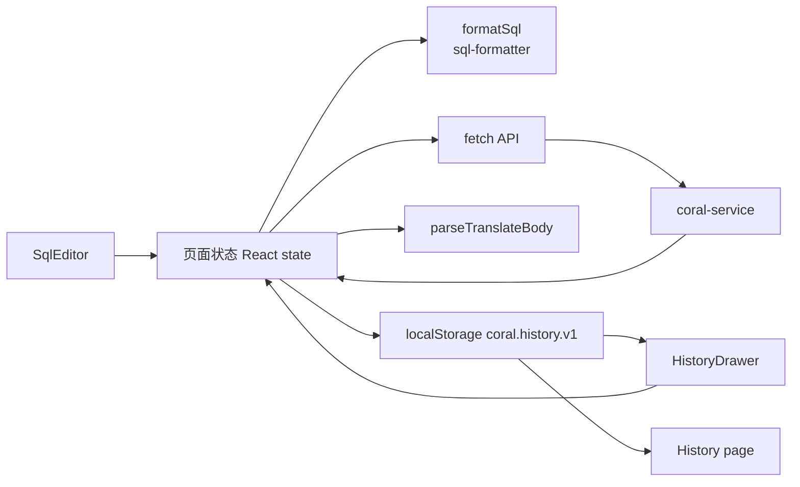

### 10.4 Recent 历史设计

```mermaid
flowchart TD
  TranslateSuccess[翻译成功] --> AddHistory[addHistory]
  AddHistory --> LocalStorage[localStorage\ncoral.history.v1]
  LocalStorage --> Event[window event\ncoral:history-changed]
  Event --> ShellCount[Shell 计数刷新]
  Event --> DrawerRefresh[Recent Drawer 刷新]
  Event --> HistoryRefresh[History Page 刷新]

  DrawerClick[点击 Recent 记录] --> SamePage{当前在翻译页?}
  SamePage -->|是| Dispatch[dispatch coral:load-history-entry]
  SamePage -->|否| Session[写入 sessionStorage\ncoral.pending-history-entry]
  Session --> Router[router.push('/')]
  Dispatch --> Fill[回填 query/source/target/result]
  Router --> Fill
```

## 11. 核心使用场景

### 11.1 CLI 本地转换

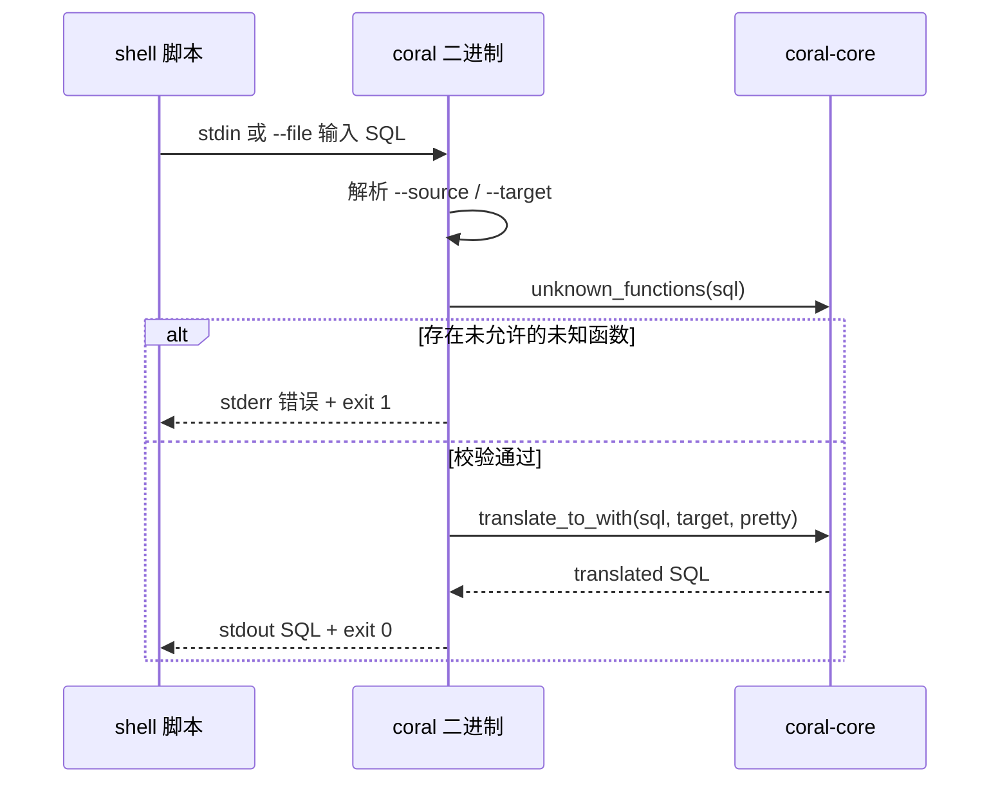

适合：

- 数据迁移脚本
- 离线批处理
- CI 中批量校验 SQL
- 不想部署 HTTP server 的场景

### 11.2 Web UI 在线转换

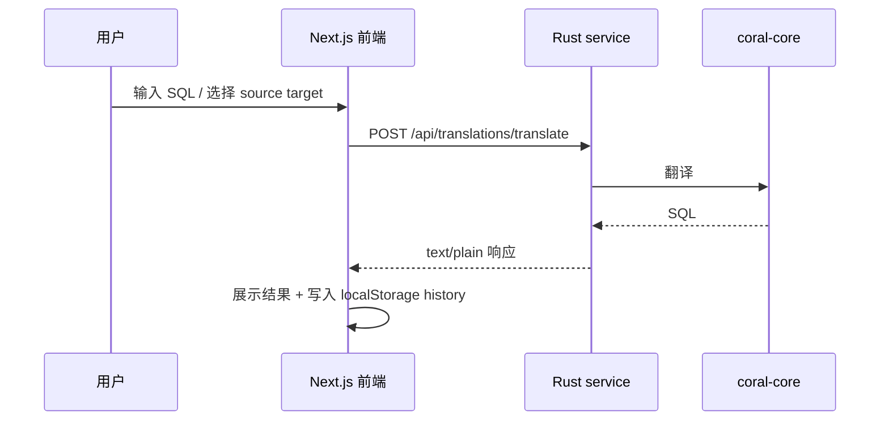

适合：

- 人工验证 SQL 转换效果
- 查看函数映射
- SQL parse 校验
- AST 可视化
- 历史记录对比

### 11.3 库 / FFI 集成

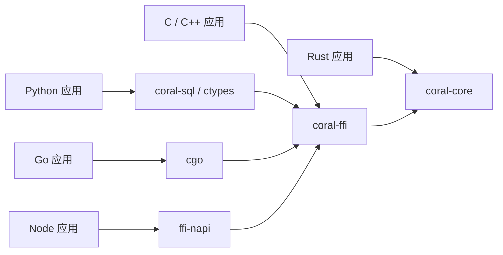

适合：

- 非 JVM 程序内嵌 SQL 转换能力
- Python 数据迁移工具
- Go / Node 服务调用本地动态库
- C/C++ 系统集成

## 12. 构建与发布设计

### 12.1 Rust 构建

```bash
cd coral-rust
cargo fmt --all
cargo clippy --all-targets --workspace -- -D warnings
cargo test --workspace --all-targets
cargo build --release --workspace
```

Release profile：

```toml
[profile.release]
lto = "thin"
codegen-units = 1
strip = "symbols"
```

### 12.2 CLI 多平台二进制

当前已验证可构建：

```text
coral-macos-arm64
coral-linux-x86_64-musl
coral-linux-arm64-musl
```

建议发布命名：

```text
coral-v0.1.0-macos-arm64
coral-v0.1.0-linux-x86_64-musl
coral-v0.1.0-linux-arm64-musl
coral-v0.1.0-windows-x86_64.exe
```

### 12.3 前端构建

```bash
cd coral-service/frontend
npm ci
npm run lint
npm run build
```

`.env.local` 中通过：

```bash
NEXT_PUBLIC_CORAL_SERVICE_API_URL=http://localhost:8080
```

指定 Rust service API 地址。

### 12.4 CI

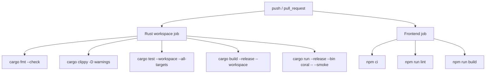

注意：如果修改 `.github/workflows/ci.yml`，推送 GitHub 时需要 token 具备 `workflow` scope。

## 13. 模块边界与数据所有权

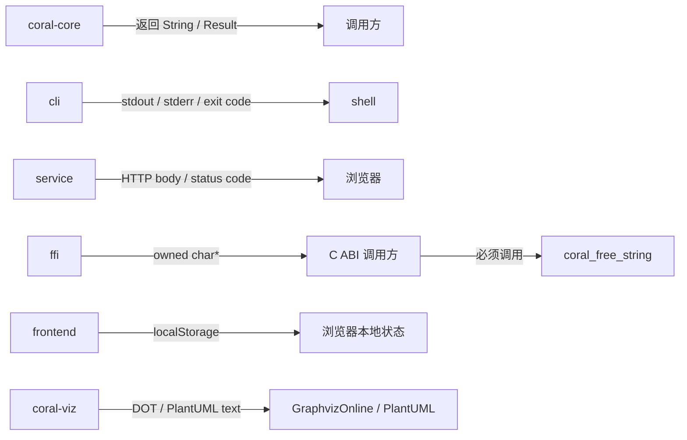

关键约束：

- `core` 不做 IO，不连数据库。
- `cli` 是进程边界，成功/失败靠退出码判断。
- `service` 是 HTTP 边界，前端通过 `fetch` 调用。
- `ffi` 是语言边界，返回内存必须由 `coral_free_string` 释放。
- `frontend` 历史记录只存在浏览器 `localStorage`，不是后端持久化。
- `viz` 输出图源码，不在服务端依赖 Graphviz 或 PlantUML 二进制。

## 14. 当前取舍与限制

| 方向 | 当前设计 | 取舍 |
|---|---|---|
| SQL parser | `sqlparser-rs` PostgreSQL dialect | 轻量、快，但不等价于 Calcite 完整语义分析 |
| Catalog | 默认不依赖 catalog | CLI 简单；schema 校验需要显式接入 catalog |
| 未知函数 | CLI 默认报错；可 UDF 白名单透传 | 防止拼写错误，同时保留业务 UDF 扩展性 |
| HTTP translate | 返回 Java 风格 `text/plain` | 兼容旧前端/Java service 行为 |
| 可视化 | 输出 DOT / PlantUML 源码 | 服务端无 Graphviz/PlantUML 运行时依赖 |
| Schema 推导 | AST + catalog 推导 | 无 Calcite RelNode 类型系统，复杂表达式保守降级 |
| Spark 集成 | 输出 `SparkView`，不操作 SparkSession | 避免 JVM/session 绑定，交给 Spark driver 接入 |
| Incremental | `2^N - 1` delta 分支展开，最多 4 表 | 保留 Java 语义，控制输出爆炸 |
| Pig | best-effort flat query 支持 | 非完整 RelNode 级转换 |

## 15. 后续可改进方向

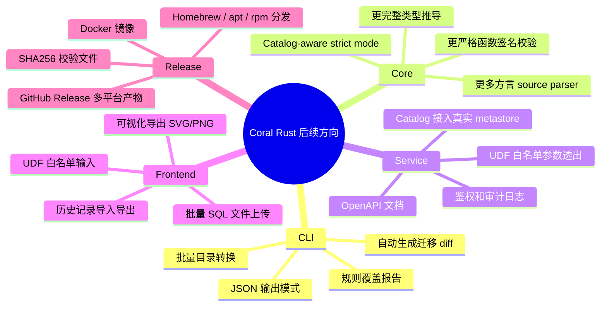

## 16. 一句话总结

当前项目的核心设计是：**把 SQL 翻译能力沉淀到轻量、无 JVM 的 `coral-core`，再通过 CLI、HTTP service、前端、FFI 等适配层提供不同使用形态；CLI 面向自动化脚本，service 面向 Web UI，FFI 面向多语言嵌入。**
