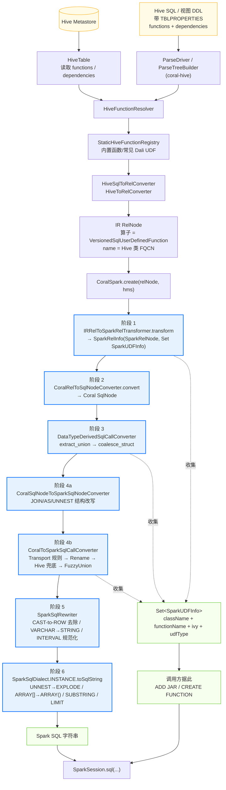
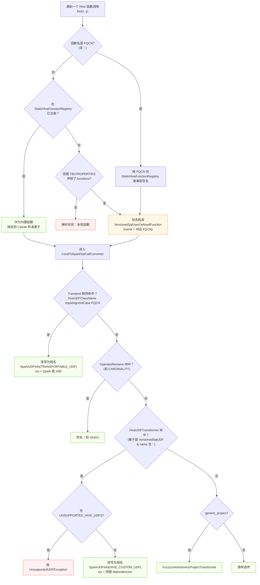
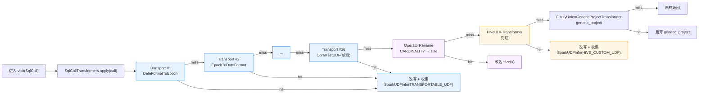
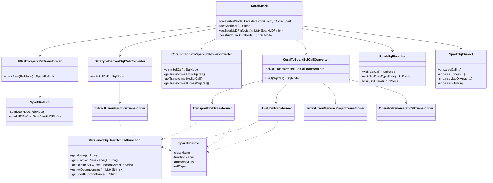
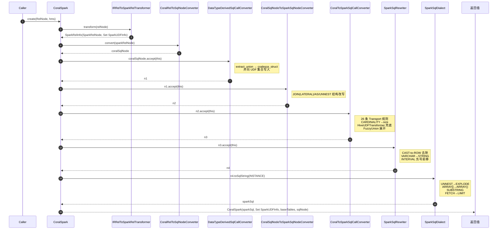
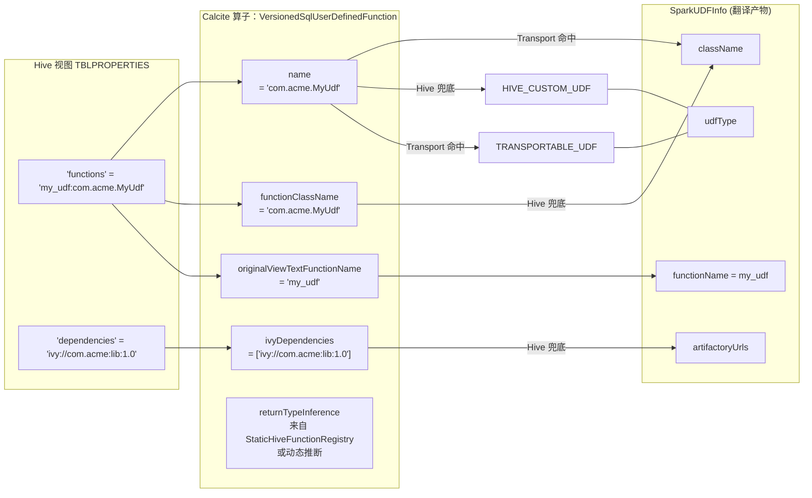

# Coral：Hive SQL → Spark SQL 全量转换对应关系

> 本文档完整梳理 Coral 项目 `coral-spark` 模块把 **Hive SQL 翻译成 Spark SQL** 的所有转换规则，包括：
> - UDF 识别与映射机制（Hive 类 ↔ Spark 类）
> - AST 重写（JOIN、LATERAL、UNNEST、AS、CAST、VARCHAR、INTERVAL…）
> - 内置算子 / 方言渲染差异（`UNNEST→EXPLODE`、`ARRAY[]→ARRAY()`、`CARDINALITY→size`、`SUBSTRING` 语法、`FETCH→LIMIT`…）
> - 类型相关 UDF 改写（`extract_union→coalesce_struct`）
>
> **核心主张**：Coral 没有任何 YAML/JSON/Properties 映射文件，全部规则都是 **Java 代码硬编码 + 多次 SqlShuttle 遍历**。

---

## 目录

- [1. 总览：翻译管线 6 大阶段](#1-总览翻译管线-6-大阶段)
- [2. 核心流程图（Mermaid）](#2-核心流程图mermaid)
  - [2.1 整体管线流程](#21-整体管线流程)
  - [2.2 UDF 识别决策树](#22-udf-识别决策树)
  - [2.3 `CoralToSparkSqlCallConverter` 规则匹配顺序](#23-coraltosparksqlcallconverter-规则匹配顺序)
  - [2.4 类结构与调用关系](#24-类结构与调用关系)
  - [2.5 端到端时序图](#25-端到端时序图)
  - [2.6 UDF 元数据与 Calcite 算子对应](#26-udf-元数据与-calcite-算子对应)
- [3. 阶段 1：Hive 端 UDF 识别](#3-阶段-1hive-端-udf-识别)
- [4. 阶段 2：AST 语法结构改写（`CoralSqlNodeToSparkSqlNodeConverter`）](#4-阶段-2ast-语法结构改写coralsqlnodetosparksqlnodeconverter)
- [5. 阶段 3：数据类型相关改写（`DataTypeDerivedSqlCallConverter`）](#5-阶段-3数据类型相关改写datatypederivedsqlcallconverter)
- [6. 阶段 4：UDF 与算子映射（`CoralToSparkSqlCallConverter`）](#6-阶段-4udf-与算子映射coraltosparksqlcallconverter)
- [7. 阶段 5：Spark AST 微调（`SparkSqlRewriter`）](#7-阶段-5spark-ast-微调sparksqlrewriter)
- [8. 阶段 6：SQL 方言渲染（`SparkSqlDialect`）](#8-阶段-6sql-方言渲染sparksqldialect)
- [9. 全量对应关系表](#9-全量对应关系表)
  - [9.1 Transport UDF 完整映射表（26 条）](#91-transport-udf-完整映射表26-条)
  - [9.2 类型 / 结构相关 UDF 改写](#92-类型--结构相关-udf-改写)
  - [9.3 内置算子 / 语法改写](#93-内置算子--语法改写)
  - [9.4 AST 结构改写](#94-ast-结构改写)
  - [9.5 数据类型改写](#95-数据类型改写)
  - [9.6 Hive UDF 兜底黑名单](#96-hive-udf-兜底黑名单)
  - [9.7 短函数名映射表](#97-短函数名映射表)
- [10. 扩展映射的 3 种典型场景](#10-扩展映射的-3-种典型场景)
- [11. 参考源文件清单](#11-参考源文件清单)

---

## 1. 总览：翻译管线 6 大阶段

`CoralSpark.create(relNode, hmsClient)` 内部按以下顺序执行：

| # | 阶段 | 入口 | 作用 |
|---|---|---|---|
| 1 | **IR → Spark Rel** | `IRRelToSparkRelTransformer.transform(relNode)` | 向 `RelNode` 层注入 Spark 特有细节 |
| 2 | **RelNode → SqlNode** | `CoralRelToSqlNodeConverter.convert(relNode)` | 得到 Coral 方言的 SqlNode AST |
| 3 | **类型派生改写** | `DataTypeDerivedSqlCallConverter`（SqlShuttle） | 依赖类型推导的改写：`extract_union→coalesce_struct` |
| 4a | **AST 结构改写** | `CoralSqlNodeToSparkSqlNodeConverter`（SqlShuttle） | LATERAL / AS / UNNEST 的结构改写 |
| 4b | **UDF & 算子映射** | `CoralToSparkSqlCallConverter`（SqlShuttle） | Hive UDF → Spark UDF（Transport 优先，Hive 兜底） |
| 5 | **Spark AST 微调** | `SparkSqlRewriter`（SqlShuttle） | CAST→ROW 去除、VARCHAR→STRING、INTERVAL 符号 |
| 6 | **方言渲染** | `SparkSqlDialect.INSTANCE`（`toSqlString`） | UNNEST→EXPLODE、ARRAY[]→ARRAY()、SUBSTRING、LIMIT |

```java
// CoralSpark.java — 核心编排
static SqlNode constructSparkSqlNode(RelNode sparkRelNode, Set<SparkUDFInfo> udfs, HiveMetastoreClient hms) {
  CoralRelToSqlNodeConverter rel2sql = new CoralRelToSqlNodeConverter();
  SqlNode coralSqlNode = rel2sql.convert(sparkRelNode);                               // 阶段 2
  SqlNode n1 = coralSqlNode.accept(new DataTypeDerivedSqlCallConverter(hms, coralSqlNode, udfs)); // 阶段 3
  SqlNode n2 = n1.accept(new CoralSqlNodeToSparkSqlNodeConverter())                   // 阶段 4a
                 .accept(new CoralToSparkSqlCallConverter(udfs));                     // 阶段 4b
  return n2.accept(new SparkSqlRewriter());                                           // 阶段 5
}
// 阶段 6：sparkSqlNode.toSqlString(SparkSqlDialect.INSTANCE).getSql()
```

---

## 2. 核心流程图（Mermaid）

### 2.1 整体管线流程



### 2.2 UDF 识别决策树



### 2.3 `CoralToSparkSqlCallConverter` 规则匹配顺序



### 2.4 类结构与调用关系



### 2.5 端到端时序图



### 2.6 UDF 元数据与 Calcite 算子对应



---

## 3. 阶段 1：Hive 端 UDF 识别

### 3.1 两种函数的识别路径

| 函数种类 | 识别来源 | Calcite 算子 |
|---|---|---|
| Hive 内置 (`sum`, `substr`, `date_format`, …) | `StaticHiveFunctionRegistry` 静态注册 | Calcite 标准算子或 `SqlUserDefinedFunction` |
| 已知 Dali UDF（常见 LinkedIn UDF） | 同上，**按 FQCN 注册类型签名** | `SqlUserDefinedFunction`，名字=FQCN |
| 用户自定义 Dali UDF | 视图 `TBLPROPERTIES` 的 `functions` / `dependencies` | `VersionedSqlUserDefinedFunction`（携带 FQCN + Ivy + 短名） |

### 3.2 关键数据结构

- `VersionedSqlUserDefinedFunction` (`coral-hive/.../functions/`)：
  - `getName()` → Hive 类的 **全限定名**（FQCN），是 Transport 规则匹配的键
  - `getOriginalViewTextFunctionName()` → 视图里原始短名（形如 `db_view_func`）
  - `getIvyDependencies()` → 视图 `dependencies` 属性值
  - `getFunctionClassName()` → 同 `getName()`
  - `getShortFunctionName()` → 短名计算（先查 `SHORT_FUNC_NAME_MAP`，不中则把类名尾段 UpperCamel 转 `lower_underscore`）

### 3.3 `StaticHiveFunctionRegistry` 的作用

该类在静态初始化块注册**大量 Hive 内置函数 + 已知 Dali UDF 的类型签名**，用于：
1. 让 Calcite 校验器能推断返回类型；
2. 让 `HiveFunctionResolver` 能按名找到算子；
3. 给 `VersionedSqlUserDefinedFunction` 提供 `returnTypeInference`。

```java
// 内置函数
addFunctionEntry("sum", SUM);
createAddUserDefinedFunction("substr", FunctionReturnTypes.STRING, ...);

// Dali UDF 以 FQCN 注册
createAddUserDefinedFunction(
    "com.linkedin.dali.udf.date.hive.DateFormatToEpoch",
    BIGINT_NULLABLE, STRING_STRING_STRING);
```

---

## 4. 阶段 2：AST 语法结构改写（`CoralSqlNodeToSparkSqlNodeConverter`）

文件：`coral-spark/src/main/java/com/linkedin/coral/spark/CoralSqlNodeToSparkSqlNodeConverter.java`

按 `SqlKind` 分派：`JOIN`、`AS`、`UNNEST` 特殊处理。

### 4.1 JOIN → LATERAL VIEW

| Hive 源 / Calcite 默认 | Spark 目标 |
|---|---|
| `SqlJoin(JoinType=COMMA)` un-parse → `FROM t, EXPLODE(...)` | `FROM t LATERAL VIEW EXPLODE(...)` |
| 右子为 `IF(col IS NOT NULL AND size(col)>0, col, ARRAY(NULL))` 的 `UNNEST` | `LATERAL VIEW OUTER EXPLODE(...)` |

实现：把 `SqlJoin` 替换成 `SqlLateralJoin`（位于 `coral-spark/functions/`），`unparse` 时自动补 `LATERAL VIEW` / `OUTER`。

### 4.2 AS → Spark LATERAL 别名语法

| Calcite 默认 | Spark 目标 |
|---|---|
| `table_alias.column_alias t0 (ccol)` | `table_alias.column_alias t0 AS ccol` |

实现：把 `AS` SqlCall 的算子替换为 `SqlLateralViewAsOperator`（位于 `coral-spark/functions/`）。若内部是 `POSEXPLODE`，操作数从 `(val, pos)` 重排回 `(pos, val)`。

### 4.3 UNNEST 的 `IF(... ARRAY(NULL))` 语法糖还原

| 输入（Coral IR） | 输出（Spark 友好） |
|---|---|
| `EXPLODE(IF(arr IS NOT NULL AND size(arr)>0, arr, ARRAY(NULL)))` | `EXPLODE(arr)` + 在 JOIN 层加 `OUTER` 关键字 |

这是为了让 Spark 的 `LATERAL VIEW OUTER EXPLODE` 简写形式生效。

---

## 5. 阶段 3：数据类型相关改写（`DataTypeDerivedSqlCallConverter`）

文件：`coral-spark/src/main/java/com/linkedin/coral/spark/DataTypeDerivedSqlCallConverter.java` 组合 `ExtractUnionFunctionTransformer`。

### 5.1 `extract_union` → `coalesce_struct`

| Hive 源 | Spark 目标 |
|---|---|
| `extract_union(col)`（col 为 uniontype） | `coalesce_struct(col)` 或 `coalesce_struct(col, 'uniontype<string>')`（单 uniontype 时额外传 schema 串） |
| `extract_union(col, ordinal)` | `coalesce_struct(col, ordinal + 1)`（ordinal 从 0 基改为 1 基） |

并向 `sparkUDFInfos` 注入：
```
className    = com.linkedin.coalescestruct.GenericUDFCoalesceStruct
functionName = coalesce_struct
ivy          = ivy://com.linkedin.coalesce-struct:coalesce-struct-impl:+
udfType      = HIVE_CUSTOM_UDF
```

---

## 6. 阶段 4：UDF 与算子映射（`CoralToSparkSqlCallConverter`）

见 [§2.3 规则匹配顺序](#23-coraltosparksqlcallconverter-规则匹配顺序) 和 [§9.1 全量 Transport 表](#91-transport-udf-完整映射表26-条)。

### 6.1 Transport UDF 路径

```java
@Override
protected boolean condition(SqlCall sqlCall) {
  return sqlCall.getOperator() instanceof VersionedSqlUserDefinedFunction
      && hiveUDFClassName.equalsIgnoreCase(sqlCall.getOperator().getName());
}

@Override
protected SqlCall transform(SqlCall sqlCall) {
  // 1) 选 Scala 2.11 或 2.12 的 Ivy
  // 2) 收集 SparkUDFInfo(TRANSPORTABLE_UDF)
  // 3) 算子改写为短名
}
```

### 6.2 Hive UDF 兜底路径

```java
@Override
protected boolean condition(SqlCall sqlCall) {
  String name = sqlCall.getOperator().getName();
  return sqlCall.getOperator() instanceof VersionedSqlUserDefinedFunction
      && name.contains(".") && !name.equals(".");
}

@Override
protected SqlCall transform(SqlCall sqlCall) {
  // 1) 检查 UNSUPPORTED_HIVE_UDFS
  // 2) 收集 SparkUDFInfo(HIVE_CUSTOM_UDF) —— 类名仍是 Hive 版，Ivy 来自视图
  // 3) 算子改写为短名
}
```

### 6.3 内置算子 Rename

```java
new OperatorRenameSqlCallTransformer(SqlStdOperatorTable.CARDINALITY, 1, "size");
```

### 6.4 `generic_project` 展开

由 `FuzzyUnionGenericProjectTransformer` 处理 Coral Schema 的 `generic_project(struct, schema_name)`，改写为一系列具名字段投影。

---

## 7. 阶段 5：Spark AST 微调（`SparkSqlRewriter`）

文件：`coral-spark/src/main/java/com/linkedin/coral/spark/SparkSqlRewriter.java`

### 7.1 CAST 到 struct/ROW 的去除

| Hive 源 | Spark 目标 |
|---|---|
| `CAST(named_struct(...) AS ROW(...))` | `named_struct(...)` |
| `CAST(named_struct(...) AS ARRAY<ROW(...)>)`（递归含 ROW） | 去掉 CAST |
| `CAST(... AS MAP<K, ROW(...)>)` | 去掉 CAST |

Spark SQL 不支持 CAST 到 struct；Coral 递归检测 `SqlRowTypeSpec` / `SqlArrayTypeSpec` / `SqlMapTypeSpec` 后剔除 CAST。

### 7.2 数据类型重命名

| Hive 源类型 | Spark 目标类型 |
|---|---|
| `VARCHAR(n)` | `STRING` |
| `ARRAY<VARCHAR(n)>`（递归） | `ARRAY<STRING>` |

### 7.3 INTERVAL 负号位置

| ANSI SQL 默认 | Spark 期望（HiveQL 风格） |
|---|---|
| `INTERVAL -'7' DAY` | `INTERVAL '-7' DAY` |

---

## 8. 阶段 6：SQL 方言渲染（`SparkSqlDialect`）

文件：`coral-spark/src/main/java/com/linkedin/coral/spark/dialect/SparkSqlDialect.java`

### 8.1 算子级渲染差异

| Calcite / Hive 默认 | Spark 方言渲染 | 说明 |
|---|---|---|
| `UNNEST(x)`（普通） | `EXPLODE(x)` | `unparseUnnest` |
| `UNNEST(x) WITH ORDINALITY`（`CoralSqlUnnestOperator.withOrdinality=true`） | `POSEXPLODE(x)` | 同上 |
| `ARRAY[a, b, c]` | `ARRAY(a, b, c)` | `unparseMapOrArray` |
| `MAP[k1, v1, k2, v2]` | `MAP(k1, v1, k2, v2)` | 同上 |
| `SUBSTRING(s FROM 1 FOR 5)` | `SUBSTRING(s, 1, 5)` | `unparseSubstring` |
| `OFFSET n FETCH m ROWS ONLY` | `LIMIT m OFFSET n` | `unparseOffsetFetch` → `unparseFetchUsingLimit` |

### 8.2 方言级全局开关

| 设置项 | 值 | 效果 |
|---|---|---|
| `supportsCharSet()` | `false` | 避免生成 `VARCHAR(30) CHARACTER SET 'ISO-8859-1'` |
| `allowsAs()` | `false` | 列别名不使用 `AS` 关键字 |
| `identifierQuoteString` | `` ` `` | 反引号引用标识符 |
| `literalQuoteString` | `'` / `\\'` | 字符串单引号 |
| `unquotedCasing` / `quotedCasing` | `UNCHANGED` | 不改大小写 |
| `nullCollation` | `LOW` | 排序时 NULL 在前 |
| 保留字表 | 见代码中 `RESERVED_KEYWORDS` | 命中则自动加反引号 |

---

## 9. 全量对应关系表

### 9.1 Transport UDF 完整映射表（26 条）

> 源文件：`coral-spark/src/main/java/com/linkedin/coral/spark/CoralToSparkSqlCallConverter.java`
> Ivy 常量：`DALI_UDFS_IVY_URL_SPARK_2_11/2_12 = ivy://com.linkedin.standard-udfs-dali-udfs:standard-udfs-dali-udfs:2.0.3?classifier=spark_2.{11,12}`

| # | Hive UDF 类（FQCN） | Spark UDF 类（FQCN） | Ivy 依赖组件 |
|---|---|---|---|
| 1  | `com.linkedin.dali.udf.date.hive.DateFormatToEpoch`                 | `com.linkedin.stdudfs.daliudfs.spark.DateFormatToEpoch`        | `standard-udfs-dali-udfs:2.0.3` |
| 2  | `com.linkedin.dali.udf.date.hive.EpochToDateFormat`                 | `com.linkedin.stdudfs.daliudfs.spark.EpochToDateFormat`        | `standard-udfs-dali-udfs:2.0.3` |
| 3  | `com.linkedin.dali.udf.date.hive.EpochToEpochMilliseconds`          | `com.linkedin.stdudfs.daliudfs.spark.EpochToEpochMilliseconds` | `standard-udfs-dali-udfs:2.0.3` |
| 4  | `com.linkedin.dali.udf.isguestmemberid.hive.IsGuestMemberId`        | `com.linkedin.stdudfs.daliudfs.spark.IsGuestMemberId`          | `standard-udfs-dali-udfs:2.0.3` |
| 5  | `com.linkedin.dali.udf.istestmemberid.hive.IsTestMemberId`          | `com.linkedin.stdudfs.daliudfs.spark.IsTestMemberId`           | `standard-udfs-dali-udfs:2.0.3` |
| 6  | `com.linkedin.dali.udf.maplookup.hive.MapLookup`                    | `com.linkedin.stdudfs.daliudfs.spark.MapLookup`                | `standard-udfs-dali-udfs:2.0.3` |
| 7  | `com.linkedin.dali.udf.sanitize.hive.Sanitize`                      | `com.linkedin.stdudfs.daliudfs.spark.Sanitize`                 | `standard-udfs-dali-udfs:2.0.3` |
| 8  | `com.linkedin.dali.udf.watbotcrawlerlookup.hive.WATBotCrawlerLookup`| `com.linkedin.stdudfs.daliudfs.spark.WatBotCrawlerLookup`      | `standard-udfs-dali-udfs:2.0.3` |
| 9  | `com.linkedin.stdudfs.daliudfs.hive.DateFormatToEpoch`              | `com.linkedin.stdudfs.daliudfs.spark.DateFormatToEpoch`        | `standard-udfs-dali-udfs:2.0.3` |
| 10 | `com.linkedin.stdudfs.daliudfs.hive.EpochToDateFormat`              | `com.linkedin.stdudfs.daliudfs.spark.EpochToDateFormat`        | `standard-udfs-dali-udfs:2.0.3` |
| 11 | `com.linkedin.stdudfs.daliudfs.hive.EpochToEpochMilliseconds`       | `com.linkedin.stdudfs.daliudfs.spark.EpochToEpochMilliseconds` | `standard-udfs-dali-udfs:2.0.3` |
| 12 | `com.linkedin.stdudfs.daliudfs.hive.GetProfileSections`             | `com.linkedin.stdudfs.daliudfs.spark.GetProfileSections`       | `standard-udfs-dali-udfs:2.0.3` |
| 13 | `com.linkedin.stdudfs.stringudfs.hive.InitCap`                      | `com.linkedin.stdudfs.stringudfs.spark.InitCap`                | `standard-udfs-common-sql-udfs:standard-udfs-string-udfs:1.0.1` |
| 14 | `com.linkedin.stdudfs.daliudfs.hive.IsGuestMemberId`                | `com.linkedin.stdudfs.daliudfs.spark.IsGuestMemberId`          | `standard-udfs-dali-udfs:2.0.3` |
| 15 | `com.linkedin.stdudfs.daliudfs.hive.IsTestMemberId`                 | `com.linkedin.stdudfs.daliudfs.spark.IsTestMemberId`           | `standard-udfs-dali-udfs:2.0.3` |
| 16 | `com.linkedin.stdudfs.daliudfs.hive.MapLookup`                      | `com.linkedin.stdudfs.daliudfs.spark.MapLookup`                | `standard-udfs-dali-udfs:2.0.3` |
| 17 | `com.linkedin.stdudfs.daliudfs.hive.PortalLookup`                   | `com.linkedin.stdudfs.daliudfs.spark.PortalLookup`             | `standard-udfs-dali-udfs:2.0.3` |
| 18 | `com.linkedin.stdudfs.daliudfs.hive.Sanitize`                       | `com.linkedin.stdudfs.daliudfs.spark.Sanitize`                 | `standard-udfs-dali-udfs:2.0.3` |
| 19 | `com.linkedin.stdudfs.userinterfacelookup.hive.UserInterfaceLookup` | `com.linkedin.stdudfs.userinterfacelookup.spark.UserInterfaceLookup` | `standard-udf-userinterfacelookup:userinterfacelookup-std-udf:0.0.27` |
| 20 | `com.linkedin.stdudfs.daliudfs.hive.WatBotCrawlerLookup`            | `com.linkedin.stdudfs.daliudfs.spark.WatBotCrawlerLookup`      | `standard-udfs-dali-udfs:2.0.3` |
| 21 | `com.linkedin.jemslookup.udf.hive.JemsLookup`                       | `com.linkedin.jemslookup.udf.spark.JemsLookup`                 | `jobs-udf:jems-udfs:2.1.7` |
| 22 | `com.linkedin.stdudfs.parsing.hive.UserAgentParser`                 | `com.linkedin.stdudfs.parsing.spark.UserAgentParser`           | `standard-udfs-parsing:parsing-stdudfs:3.0.3` |
| 23 | `com.linkedin.stdudfs.parsing.hive.Ip2Str`                          | `com.linkedin.stdudfs.parsing.spark.Ip2Str`                    | `standard-udfs-parsing:parsing-stdudfs:3.0.3` |
| 24 | `com.linkedin.stdudfs.lookup.hive.BrowserLookup`                    | `com.linkedin.stdudfs.lookup.spark.BrowserLookup`              | `standard-udfs-parsing:parsing-stdudfs:3.0.3` |
| 25 | `com.linkedin.jobs.udf.hive.ConvertIndustryCode`                    | `com.linkedin.jobs.udf.spark.ConvertIndustryCode`              | `jobs-udf:jobs-udfs:2.1.6` |
| 26 | `com.linkedin.coral.hive.hive2rel.CoralTestUDF` *(单测)*             | `com.linkedin.coral.spark.CoralTestUDF`                        | `com.linkedin.coral.spark.CoralTestUDF?classifier=spark_2.11` |

### 9.2 类型 / 结构相关 UDF 改写

| # | Hive 源 | Spark 目标 | 规则位置 |
|---|---|---|---|
| 1 | `extract_union(col)`（uniontype） | `coalesce_struct(col)` | `ExtractUnionFunctionTransformer` |
| 2 | `extract_union(col)`（单 uniontype，已被 Spark 压平） | `coalesce_struct(col, 'uniontype<...>')` | 同上 |
| 3 | `extract_union(col, ord)` | `coalesce_struct(col, ord + 1)` | 同上 |
| 4 | `generic_project(struct, name)` | 展开为若干具名字段投影（Coral Schema） | `FuzzyUnionGenericProjectTransformer` |

### 9.3 内置算子 / 语法改写

| # | Hive / Calcite 默认 | Spark 目标 | 规则位置 |
|---|---|---|---|
| 1 | `CARDINALITY(arr)` | `size(arr)` | `OperatorRenameSqlCallTransformer` |
| 2 | `UNNEST(arr)` | `EXPLODE(arr)` | `SparkSqlDialect.unparseUnnest` |
| 3 | `UNNEST(arr) WITH ORDINALITY` | `POSEXPLODE(arr)` | 同上 |
| 4 | `ARRAY[a, b]` | `ARRAY(a, b)` | `SparkSqlDialect.unparseMapOrArray` |
| 5 | `MAP[k1, v1, k2, v2]` | `MAP(k1, v1, k2, v2)` | 同上 |
| 6 | `SUBSTRING(s FROM 1 FOR 5)` | `SUBSTRING(s, 1, 5)` | `SparkSqlDialect.unparseSubstring` |
| 7 | `OFFSET n FETCH m ROWS ONLY` | `LIMIT m OFFSET n` | `SparkSqlDialect.unparseOffsetFetch` |
| 8 | 标识符 `CHARACTER SET 'XXX'` | 去除 | `supportsCharSet=false` |
| 9 | 列别名用 `AS` | 列别名省 `AS` | `allowsAs=false` |
| 10 | 保留字标识符 | 自动反引号包裹 | `RESERVED_KEYWORDS` + `identifierNeedsQuote` |

### 9.4 AST 结构改写

| # | Hive / Coral IR 默认 | Spark 目标 | 规则位置 |
|---|---|---|---|
| 1 | `FROM t, UNNEST(...)`（COMMA JOIN） | `FROM t LATERAL VIEW EXPLODE(...)` | `CoralSqlNodeToSparkSqlNodeConverter#getTransformedJoinSqlCall` → `SqlLateralJoin` |
| 2 | 带 `IF(arr IS NOT NULL..., arr, ARRAY(NULL))` 的 UNNEST | `LATERAL VIEW OUTER EXPLODE(arr)` | 同上 + `getTransformedUnnestSqlCall` |
| 3 | `table_alias t0 (ccol)` | `table_alias t0 AS ccol` | `getTransformedAsSqlCall` → `SqlLateralViewAsOperator` |
| 4 | `POSEXPLODE` 别名顺序 `(val, pos)` | `(pos, val)` | 同上（配合 `CoralSqlUnnestOperator.withOrdinality`） |
| 5 | `COLLECTION_TABLE(fn(...))` 表名打印 | 省略表名前缀 | 同上 |

### 9.5 数据类型改写

| # | Hive 源 | Spark 目标 | 规则位置 |
|---|---|---|---|
| 1 | `VARCHAR(n)` | `STRING` | `SparkSqlRewriter#visit(SqlDataTypeSpec)` |
| 2 | `ARRAY<VARCHAR(n)>`（递归） | `ARRAY<STRING>` | 同上 |
| 3 | `CAST(named_struct(...) AS ROW(...))` | `named_struct(...)`（丢弃 CAST） | `SparkSqlRewriter#visit(SqlCall)` |
| 4 | `CAST(... AS ARRAY<ROW(...)>)` | 丢弃 CAST | 同上（递归检查） |
| 5 | `CAST(... AS MAP<K, ROW(...)>)` | 丢弃 CAST | 同上 |
| 6 | `INTERVAL -'7' DAY` | `INTERVAL '-7' DAY` | `SparkSqlRewriter#visit(SqlLiteral)` |

### 9.6 Hive UDF 兜底黑名单

> 位于 `HiveUDFTransformer.UNSUPPORTED_HIVE_UDFS`。命中直接抛 `UnsupportedUDFException`。

| Hive UDF 类 | 原因 |
|---|---|
| `com.linkedin.dali.udf.userinterfacelookup.hive.UserInterfaceLookup` | Spark 可创建 DataFrame，但执行阶段失败 |
| `com.linkedin.dali.udf.portallookup.hive.PortalLookup` | 同上 |
| `com.linkedin.coral.hive.hive2rel.CoralTestUnsupportedUDF` | 单测用 |

### 9.7 短函数名映射表

> `VersionedSqlUserDefinedFunction.SHORT_FUNC_NAME_MAP`。用于从 FQCN 推断短名时覆盖默认的 `UpperCamel → lower_underscore` 规则。

| Hive / Spark 类 | 约定短名 |
|---|---|
| `com.linkedin.dali.udf.watbotcrawlerlookup.hive.WATBotCrawlerLookup` | `wat_bot_crawler_lookup` |
| `com.linkedin.stdudfs.parsing.hive.Ip2Str`                          | `ip2str` |
| `com.linkedin.stdudfs.parsing.hive.UserAgentParser`                 | `useragentparser` |
| `com.linkedin.stdudfs.lookup.hive.BrowserLookup`                    | `browserlookup` |
| `com.linkedin.jobs.udf.hive.ConvertIndustryCode`                    | `converttoindustryv1` |
| `com.linkedin.stdudfs.urnextractor.hive.UrnExtractorFunctionWrapper`| `urn_extractor` |
| `com.linkedin.stdudfs.hive.daliudfs.UrnExtractorFunctionWrapper`    | `urn_extractor` |
| `com.linkedin.groot.runtime.udf.spark.HasMemberConsentUDF`          | `has_member_consent` |
| `com.linkedin.groot.runtime.udf.spark.RedactFieldIfUDF`             | `redact_field_if` |
| `com.linkedin.groot.runtime.udf.spark.RedactSecondarySchemaFieldIfUDF` | `redact_secondary_schema_field_if` |
| `com.linkedin.groot.runtime.udf.spark.GetMappedValueUDF`            | `get_mapped_value` |
| `com.linkedin.groot.runtime.udf.spark.ExtractCollectionUDF`         | `extract_collection` |
| `com.linkedin.coral.hive.hive2rel.CoralTestUDF`                     | `coral_test` |

### 9.8 Hive 内置函数（StaticHiveFunctionRegistry，节选）

> 这些函数由 Calcite 标准算子承担，Spark 方言渲染时**直接等价输出**，不走 Transport / Hive 兜底。

| 分类 | 函数名 |
|---|---|
| 聚合 | `sum`、`count`、`avg`、`min`、`max`、`collect_list`、`collect_set` |
| 窗口 | `row_number`、`rank`、`dense_rank`、`cume_dist`、`percent_rank`、`first_value`、`last_value`、`nth_value`、`lag`、`lead` |
| 统计 | `stddev`、`stddev_samp`、`stddev_pop`、`variance`、`var_samp`、`var_pop` |
| 条件 | `if`、`case`、`when`、`between`、`nullif`、`coalesce`、`isnull`、`isnotnull`、`nvl`、`tok_isnull`、`tok_isnotnull` |
| 运算/比较 | `rlike`、`regexp`、`!=`、`==`、`in` |
| 数学 | `pmod`、`round`、`bround`、`floor`、`ceil`/`ceiling`、`rand`、`exp`、`ln`、`log`/`log10`/`log2`、`pow`/`power`、`sqrt`、`abs`、`sin`/`asin`/`cos`/`acos`/`tan`/`atan`、`degrees`、`radians`、`positive`、`negative`、`sign`、`e`、`pi`、`factorial`、`cbrt`、`shiftleft`、`shiftright`、`shiftrightunsigned`、`greatest`、`least`、`width_bucket`、`hex`、`unhex`、`conv` |
| 字符串 | `ascii`、`base64`、`character_length`、`chr`、`concat`、`concat_ws`、`context_ngrams`、`decode`、`elt`、`encode`、`field`、`find_in_set`、`format_number`、`get_json_object`、`in_file`、`initcap`、`instr`、`length`、`levenshtein`、`locate`、`lower`/`lcase`、`translate`/`translate3`、`lpad`、`ltrim`、`ngrams`、`octet_length`、`parse_url`、`printf`、`regexp_extract`、`regexp_replace`、`repeat`、`replace`、`reverse`、`rpad`、`rtrim`、`sentences`、`soundex`、`space`、`split`、`str_to_map`、`substr`、`substring`、`substring_index`、`trim`、`unbase64`、`upper`/`ucase`、`md5`、`sha`/`sha1`、`crc32`、`from_utf8`、`at_timezone`、`with_timezone`、`to_unixtime`、`from_unixtime_nanos` |
| xpath | `xpath`、`xpath_string`、`xpath_boolean`、`xpath_short`、`xpath_int`、`xpath_long`、`xpath_float`、`xpath_double`、`xpath_number` |
| 日期 | `from_unixtime`、`timestamp_from_unixtime`、`unix_timestamp`、`to_date`、`date`、`year`、`quarter`、`month`、`day`/`dayofmonth`、`hour`、`minute`、`second`、`weekofyear`、`datediff`、`date_add`、`date_sub`、`from_utc_timestamp`、`to_utc_timestamp`、`current_date`、`current_timestamp`、`add_months`、`last_day`、`next_day`、`trunc`、`months_between`、`date_format` |
| 集合 | `size`、`array_contains`、`map_keys`、`map_values`、`sort_array` |
| 复合类型构造 | `array`、`struct`、`map`、`named_struct`、`generic_project` |
| 转换 | `binary`、`cast` |
| Union | `extract_union`、`coalesce_struct`（注意：`extract_union` 在阶段 3 被改写成 `coalesce_struct`） |

---

## 10. 扩展映射的 3 种典型场景

### 场景 A：已有 Spark Transport 版 UDF

在 `CoralToSparkSqlCallConverter` 的 Transport 规则段落新增：

```java
new TransportUDFTransformer(
    "com.acme.udf.hive.MyUdf",
    "com.acme.udf.spark.MyUdf",
    "ivy://com.acme:my-udfs:1.0.0?classifier=spark_2.11",
    "ivy://com.acme:my-udfs:1.0.0?classifier=spark_2.12",
    sparkUDFInfos),
```

若需特殊短名，补一条 `SHORT_FUNC_NAME_MAP`。

### 场景 B：无 Transport 版，直接用 Hive UDF 跑 Spark

**零代码改动**：只要视图 `TBLPROPERTIES` 的 `functions` / `dependencies` 写对，`HiveUDFTransformer` 自动兜底，产出 `HIVE_CUSTOM_UDF` 类型的 `SparkUDFInfo`。

### 场景 C：Spark 执行层不兼容

把 FQCN 加入 `HiveUDFTransformer.UNSUPPORTED_HIVE_UDFS`，让 Coral 在翻译时显式失败，由上层降级到 Hive 执行。

---

## 11. 参考源文件清单

### coral-spark

| 路径 | 作用 |
|---|---|
| `CoralSpark.java` | 主入口 |
| `IRRelToSparkRelTransformer.java` | IR→Spark RelNode |
| `DataTypeDerivedSqlCallConverter.java` | 阶段 3 入口 |
| `transformers/ExtractUnionFunctionTransformer.java` | `extract_union → coalesce_struct` |
| `CoralSqlNodeToSparkSqlNodeConverter.java` | 阶段 4a：JOIN/AS/UNNEST 结构改写 |
| `functions/SqlLateralJoin.java` | `FROM t, X` → `FROM t LATERAL VIEW X` |
| `functions/SqlLateralViewAsOperator.java` | `t (ccol)` → `t AS ccol` |
| **`CoralToSparkSqlCallConverter.java`** | 阶段 4b：Transport + 兜底 主战场 |
| `transformers/TransportUDFTransformer.java` | Hive UDF → Spark Transport UDF |
| `transformers/HiveUDFTransformer.java` | Hive UDF 兜底 |
| `transformers/FuzzyUnionGenericProjectTransformer.java` | `generic_project` 展开 |
| `containers/SparkUDFInfo.java` | 输出结构 |
| `containers/SparkRelInfo.java` | IR→Spark 阶段的复合产物 |
| `SparkSqlRewriter.java` | 阶段 5：AST 微调 |
| `dialect/SparkSqlDialect.java` | 阶段 6：方言渲染 |
| `AddExplicitAlias.java` | 显式输出列别名 |

### coral-hive

| 路径 | 作用 |
|---|---|
| `functions/StaticHiveFunctionRegistry.java` | 内置函数 + 已知 Dali UDF 静态注册 |
| `functions/HiveFunctionResolver.java` | 函数名 → 算子 解析器 |
| `functions/VersionedSqlUserDefinedFunction.java` | Dali UDF 的 Calcite 算子封装 |
| `functions/ArtifactsResolver.java` | Ivy 依赖解析辅助 |
| `HiveToRelConverter.java` | Hive SqlNode → RelNode |
| `DaliOperatorTable.java` | 算子表 |

### coral-common

| 路径 | 作用 |
|---|---|
| `transformers/SqlCallTransformer.java` | 转换器基类（`condition` + `transform`） |
| `transformers/SqlCallTransformers.java` | 转换器组合 + 按序应用 |
| `transformers/OperatorRenameSqlCallTransformer.java` | 算子重命名（如 `CARDINALITY → size`） |
| `utils/TypeDerivationUtil.java` | 辅助类型推导 |

### coral-hive 下的跨方言组件

| 路径 | 作用 |
|---|---|
| `coral-hive/.../transformers/CoralRelToSqlNodeConverter.java` | RelNode → SqlNode（方言无关） |

---

> **一句话收尾**：Coral 的 Hive→Spark 翻译不是一个"函数名字典映射"，而是 **"Calcite RelNode → 多次 SqlShuttle 遍历 → Spark 方言 unparse"** 的多阶段管线；UDF 映射只是其中阶段 4b 的一部分，全部关系都以 Java 代码维护在 `coral-spark` 模块里。
